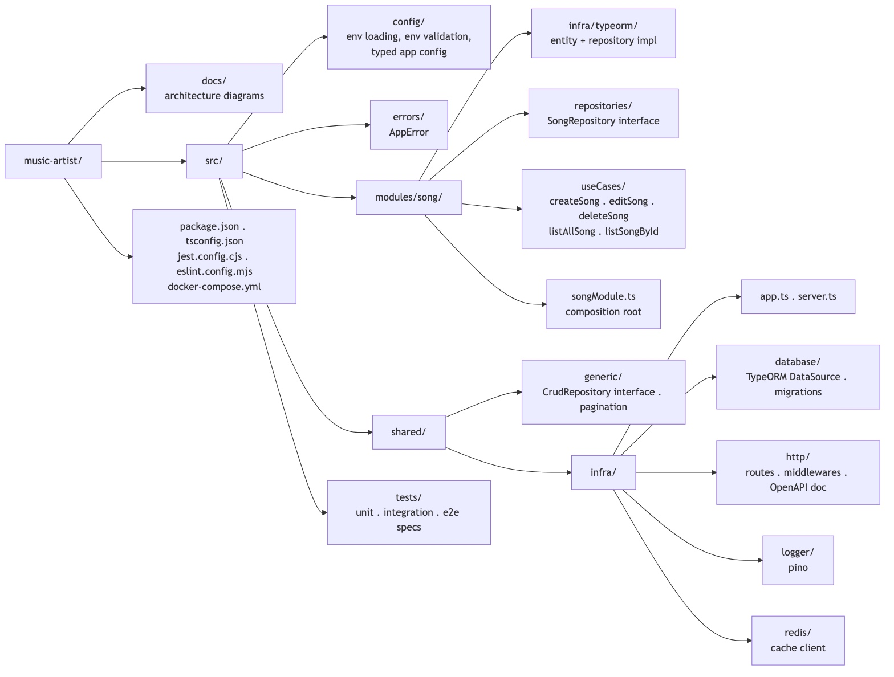
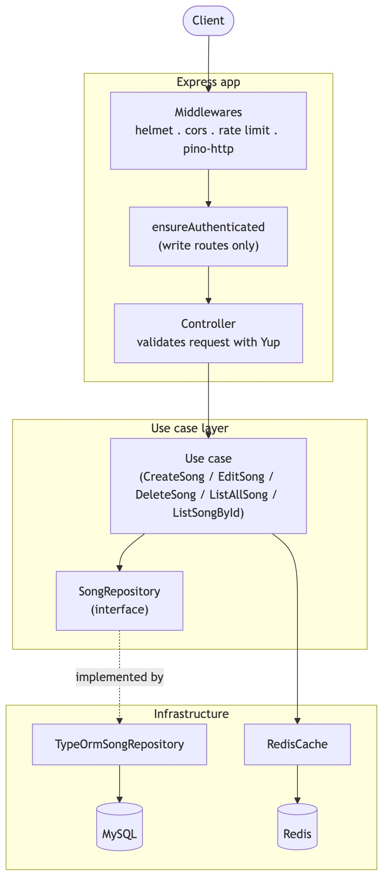

# Music Artist API

[](https://github.com/luizcurti/music-artist/actions/workflows/ci.yml)
[](LICENSE)
[](tsconfig.json)

A REST API for managing a song catalog, built with Node.js, TypeScript, Express, TypeORM, and Redis.

## Table of Contents

- [About](#about)
- [Technologies](#technologies)
- [Architecture](#architecture)
- [Prerequisites](#prerequisites)
- [Installation](#installation)
- [Configuration](#configuration)
- [Running the Application](#running-the-application)
- [Available Scripts](#available-scripts)
- [Project Structure](#project-structure)
- [API Endpoints](#api-endpoints)
- [Authentication](#authentication)
- [Tests](#tests)
- [Code Style & Git Hooks](#code-style--git-hooks)
- [Docker](#docker)
- [License](#license)

## About

Music Artist API is a backend service for managing a catalog of songs. It provides full CRUD operations with Redis caching, MySQL persistence, pagination/filtering, and input validation.

### Features

- Full song management (CRUD), plus pagination and filtering on the list endpoint
- Redis caching (1-hour TTL), with cache population on both writes and read misses
- Input validation with Yup, including environment-variable validation at startup
- API key authentication and rate limiting on write endpoints
- Interactive API docs (OpenAPI/Swagger UI) generated from the same Yup schemas that validate requests
- Structured JSON logging (pino), including per-request logs
- A `/health` endpoint reporting database and Redis connectivity
- Database migrations with TypeORM
- Unit, integration, and end-to-end tests with Jest, enforced at 100% coverage
- Plain constructor-based dependency injection (no DI framework/decorators for wiring)

## Technologies

### Backend

- **Node.js 18+** — Runtime
- **TypeScript** — Static typing
- **Express** — HTTP framework
- **TypeORM** — ORM for MySQL

### Database & Cache

- **MySQL 8.0** — Primary data store
- **Redis** — In-memory cache (TTL: 1h)

### DevOps & Tooling

- **Docker / Docker Compose** — Local infrastructure
- **Jest + ts-jest + Supertest** — Unit, integration and e2e testing
- **ESLint + Prettier** — Linting and formatting, enforced on commit via Husky + lint-staged
- **Yup** — Schema validation (request bodies, query params, and environment variables)
- **pino** — Structured logging
- **swagger-ui-express** — Interactive API documentation
- **helmet / cors / express-rate-limit** — Security middlewares

## Architecture

The codebase follows a lightweight, use-case-oriented layout — each operation (create, edit, delete, list) is its own controller/use case pair, depending on a repository interface rather than a concrete implementation (dependency inversion). This keeps the business logic testable in isolation without pulling in a database or an HTTP server.

Deliberately **not** included: a DI container/decorators (wiring is a handful of `new` calls in [`songModule.ts`](src/modules/song/songModule.ts)), and DDD tactical patterns like entities/value objects/aggregates — the domain here is a single CRUD resource, so an anemic model and a generic repository are enough. Adding either would be complexity without a matching benefit for this project's size.





More diagrams (request lifecycle, cache read-through, authentication, CI pipeline) are in [`docs/architecture.md`](docs/architecture.md).

## Prerequisites

- [Node.js](https://nodejs.org/) v18 or higher
- [npm](https://www.npmjs.com/)
- [Docker](https://www.docker.com/) and [Docker Compose](https://docs.docker.com/compose/)

## Installation

```bash
git clone https://github.com/luizcurti/music-artist.git
cd music-artist
npm install
```

`npm install` also registers the Git hooks (via Husky's `prepare` script) that run lint-staged on commit.

## Configuration

Copy `.env.example` to `.env` and adjust as needed:

```bash
cp .env.example .env
```

```env
NODE_ENV=development
PORT=3005

DB_HOST=localhost
DB_PORT=3306
DB_USER=root
DB_PASSWORD=root
DB_DATABASE=music

REDIS_HOST=localhost
REDIS_PORT=6379

X_API_KEY=replace-with-a-random-secret
```

All environment variables are validated at startup (see [`src/config/envSchema.ts`](src/config/envSchema.ts)) — the app fails fast with a clear error if something required is missing or malformed.

## Running the Application

### 1. Start infrastructure services

```bash
docker compose up -d mysql_database redis_server
```

### 2. Run database migrations

```bash
npm run typeorm
```

### 3. Start the application

```bash
# Development (with hot reload)
npm run dev

# Development (kills port 3005 first)
npm run dev:clean
```

The API will be available at `http://localhost:3005`, with interactive docs at `http://localhost:3005/docs`.

## Available Scripts

| Script                     | Description                                                                |
| -------------------------- | -------------------------------------------------------------------------- |
| `npm run dev`              | Start in development mode with hot reload                                  |
| `npm run dev:clean`        | Kill port 3005 then start in development mode                              |
| `npm run build`            | Compile TypeScript to JavaScript                                           |
| `npm run start`            | Start compiled app in production mode                                      |
| `npm run start:clean`      | Kill port 3005 then start in production mode                               |
| `npm test`                 | Run unit + integration + e2e tests with coverage                           |
| `npm run test:unit`        | Run unit tests only (no external services needed)                          |
| `npm run test:integration` | Run integration tests (needs MySQL + Redis)                                |
| `npm run test:e2e`         | Run end-to-end tests (needs MySQL + Redis)                                 |
| `npm run eslint`           | Run ESLint                                                                 |
| `npm run typecheck`        | Type-check without emitting output                                         |
| `npm run format`           | Format the codebase with Prettier                                          |
| `npm run format:check`     | Check formatting without writing changes                                   |
| `npm run typeorm`          | Run pending database migrations                                            |
| `npm run typeorm:show`     | Show migration status                                                      |
| `npm run typeorm:revert`   | Revert the last migration                                                  |
| `npm run docs:diagrams`    | Regenerate `docs/images/*.jpg` from the `.mmd` sources in `docs/diagrams/` |
| `npm run kill:3005`        | Kill any process running on port 3005                                      |

## Project Structure

```
music-artist/
├── docs/
│   ├── architecture.md           # Diagrams: layers, request lifecycle, caching, auth, CI
│   ├── diagrams/                 # Mermaid (.mmd) sources for the diagrams
│   └── images/                   # Rendered .jpg diagrams, embedded in this README and architecture.md
├── src/
│   ├── config/                   # Env loading, env validation, typed app config
│   ├── errors/                   # AppError class
│   ├── modules/
│   │   └── song/
│   │       ├── infra/typeorm/    # Entity + TypeORM repository implementation
│   │       ├── repositories/     # Repository interface (SongRepository)
│   │       ├── useCases/         # createSong | editSong | deleteSong | listAllSong | listSongById
│   │       └── songModule.ts     # Composition root — wires repository → use cases → controllers
│   ├── shared/
│   │   ├── generic/               # Generic CrudRepository interface + pagination helper
│   │   └── infra/
│   │       ├── app.ts             # Express app bootstrap
│   │       ├── server.ts          # HTTP server entry point
│   │       ├── database/          # TypeORM DataSource + migrations
│   │       ├── http/               # Routes, middlewares, and the OpenAPI document
│   │       ├── logger/             # pino logger
│   │       └── redis/              # Redis cache client
│   └── tests/                    # unit / integration / e2e specs
├── music.collection.json         # Postman collection
├── docker-compose.yml
├── package.json
├── tsconfig.json
├── jest.config.cjs
├── .prettierrc.json
└── eslint.config.mjs
```

## API Endpoints

Base URL: `http://localhost:3005/api/music`

| Method   | Endpoint         | Auth        | Description                               |
| -------- | ---------------- | ----------- | ----------------------------------------- |
| `GET`    | `/api/music/`    | —           | List songs (paginated, filterable)        |
| `GET`    | `/api/music/:id` | —           | Get a song by ID                          |
| `POST`   | `/api/music/`    | `x-api-key` | Create a new song                         |
| `PUT`    | `/api/music/:id` | `x-api-key` | Update a song                             |
| `DELETE` | `/api/music/:id` | `x-api-key` | Delete a song                             |
| `GET`    | `/health`        | —           | Liveness/readiness (database + Redis)     |
| `GET`    | `/docs`          | —           | Interactive OpenAPI/Swagger documentation |

Write endpoints are also rate-limited (100 requests / 15 minutes per IP by default — see [`rateLimiter.ts`](src/shared/infra/http/middlewares/rateLimiter.ts)).

### Request / Response

#### GET `/api/music/` — List songs

**Query params** (all optional):

| Param           | Type     | Default | Description                      |
| --------------- | -------- | ------- | -------------------------------- |
| `page`          | `number` | `1`     | Page number (1-indexed)          |
| `limit`         | `number` | `20`    | Items per page (max 100)         |
| `name`          | `string` | —       | Case-insensitive substring match |
| `artist`        | `string` | —       | Case-insensitive substring match |
| `popularityMin` | `number` | —       | Minimum popularity (0–10)        |
| `popularityMax` | `number` | —       | Maximum popularity (0–10)        |

**Response `200 OK`:**

```json
{
  "data": [
    {
      "id": "550e8400-e29b-41d4-a716-446655440000",
      "name": "Bohemian Rhapsody",
      "artist": "Queen",
      "imageurl": "https://example.com/image.jpg",
      "notes": "A classic rock opera ballad.",
      "popularity": 10,
      "created_at": "2026-01-01T00:00:00.000Z",
      "updated_at": "2026-01-01T00:00:00.000Z"
    }
  ],
  "meta": { "page": 1, "limit": 20, "total": 1, "totalPages": 1 }
}
```

#### POST `/api/music/` — Create a song

**Request body:**

```json
{
  "name": "Bohemian Rhapsody",
  "artist": "Queen",
  "imageurl": "https://example.com/image.jpg",
  "notes": "A classic rock opera ballad.",
  "popularity": 10
}
```

**Response `201 Created`:**

```json
{
  "id": "550e8400-e29b-41d4-a716-446655440000",
  "name": "Bohemian Rhapsody",
  "artist": "Queen",
  "imageurl": "https://example.com/image.jpg",
  "notes": "A classic rock opera ballad.",
  "popularity": 10,
  "created_at": "2026-01-01T00:00:00.000Z",
  "updated_at": "2026-01-01T00:00:00.000Z"
}
```

#### PUT `/api/music/:id` — Update a song

**Request body** (all fields required):

```json
{
  "name": "Bohemian Rhapsody",
  "artist": "Queen",
  "imageurl": "https://example.com/image.jpg",
  "notes": "Updated notes.",
  "popularity": 9
}
```

**Response `200 OK`:** returns the updated song object.

#### DELETE `/api/music/:id`

**Response `204 No Content`**

### Field Reference

| Field        | Type     | Rules          |
| ------------ | -------- | -------------- |
| `name`       | `string` | Required       |
| `artist`     | `string` | Required       |
| `imageurl`   | `string` | Required       |
| `notes`      | `string` | Required       |
| `popularity` | `number` | Required, 0–10 |

### Error format

```json
{
  "message": "Human-readable error description",
  "type": "ERROR_CODE"
}
```

## Authentication

The `ensureAuthenticated` middleware validates the `x-api-key` header against the `X_API_KEY` environment variable. It's applied to the write endpoints (`POST`, `PUT`, `DELETE`); reads are public. Requests without a valid key receive `401 Unauthorized`.

## Tests

The suite is split into three layers, matching what each test actually exercises:

- **Unit** (`*.unit.spec.ts`) — use cases, controllers, middlewares, error types, env validation, and the OpenAPI schema generation, with all I/O mocked. No external services required.
- **Integration** (`*.integration.spec.ts`) — the TypeORM repository (including pagination/filtering) and the Redis cache against real MySQL/Redis instances, without going through HTTP.
- **E2E** (`*.e2e.spec.ts`) — the full HTTP flow via Supertest against the in-process Express app (no separately-running server needed).

```bash
npm run test:unit                # no services needed

docker compose up -d mysql_database redis_server
npm run typeorm                  # apply migrations
npm run test:integration
npm run test:e2e

npm test                         # all three, with merged coverage
```

Coverage is enforced at 100% (statements/branches/functions/lines) for everything except the process entrypoint, the TypeORM `DataSource` bootstrap, and migration files — these are framework wiring, not logic worth unit-testing in isolation. See `coveragePathIgnorePatterns` in [`jest.config.cjs`](jest.config.cjs).

## Code Style & Git Hooks

ESLint and Prettier are wired together (`eslint-config-prettier` disables the stylistic rules Prettier already owns). A Husky `pre-commit` hook runs `lint-staged`, which lints and formats only the files you're committing:

```bash
npm run eslint          # lint the whole project
npm run format          # format the whole project
npm run format:check    # verify formatting in CI without writing changes
```

## Docker

```bash
# Start all services (MySQL + Redis + app)
docker compose up -d

# Start only infrastructure
docker compose up -d mysql_database redis_server

# Stop all services
docker compose down

# View logs
docker compose logs -f
```

### Services

| Service          | Image          | Port               |
| ---------------- | -------------- | ------------------ |
| `mysql_database` | mysql:8.0      | 3307 (host) → 3306 |
| `redis_server`   | redis:alpine   | 6379               |
| `app`            | node:22-alpine | 3005               |

## License

ISC — see [LICENSE](LICENSE) for details.

## Author

**Luiz Curti** — [@luizcurti](https://github.com/luizcurti)
