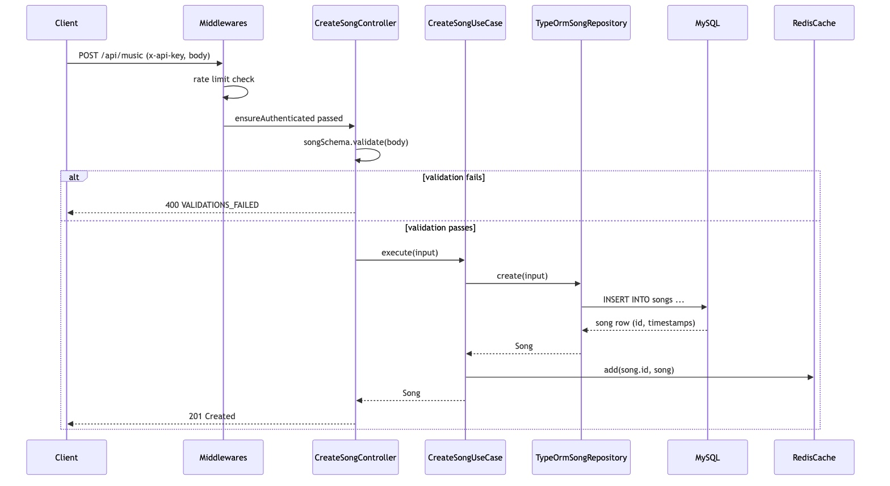
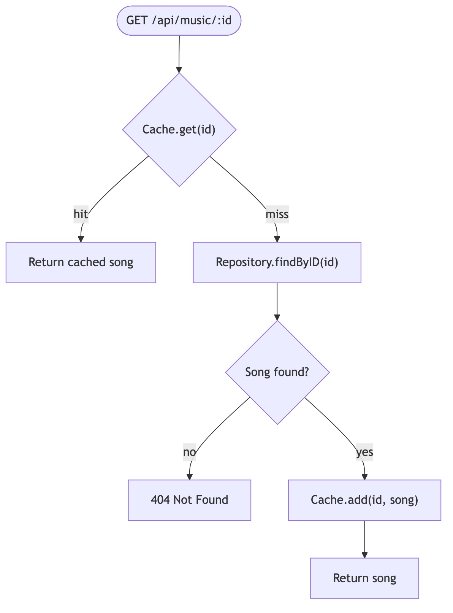
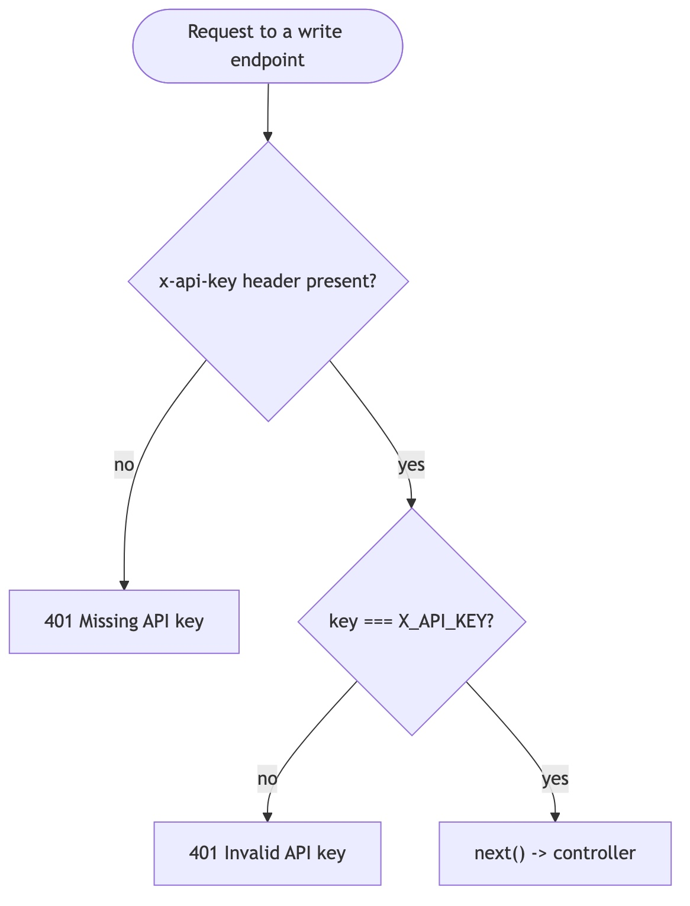
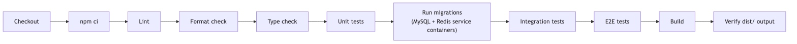

# Architecture

Diagrams for the project structure and the flows that matter most in this codebase. Each image is rendered from a `.mmd` [Mermaid](https://mermaid.js.org/) source file kept alongside it in [`docs/diagrams/`](diagrams/) (source) and rendered to [`docs/images/`](images/) — regenerate them with `npm run docs:diagrams` after editing a `.mmd` file, instead of hand-editing the images.

## Table of Contents

- [Project structure](#project-structure)
- [Layered architecture](#layered-architecture)
- [Request lifecycle](#request-lifecycle-create-a-song)
- [Cache read-through (get by id)](#cache-read-through-get-song-by-id)
- [Authentication](#authentication)
- [CI pipeline](#ci-pipeline)

## Project structure

## Layered architecture

Each HTTP verb maps to one controller/use-case pair. Controllers depend only on their use case; use cases depend only on the `SongRepository` interface (never the TypeORM implementation directly) — that inversion is what lets the use case unit tests run with a plain mock and no database.

## Request lifecycle: create a song

`POST /api/music` — the shape every write endpoint follows: validate at the edge, fail fast with a typed `AppError`, only touch infrastructure once the input is trusted.

Unexpected errors thrown from any layer are caught by `express-async-errors` and land in `handlingErrors`, which distinguishes a known `AppError` (mapped to its own status code) from anything else (logged via `logger.error` and returned as a generic `500`).

## Cache read-through: get song by id

`GET /api/music/:id` — this is the one flow worth diagramming on its own, because the cache-miss path _writes back_ to the cache before returning, so a cold cache self-heals on the next read instead of staying cold until the next write.

## Authentication

`ensureAuthenticated` guards the write endpoints (`POST` / `PUT` / `DELETE`); reads stay public.

## CI pipeline

Runs on every push/PR to `main` (see [`.github/workflows/ci.yml`](../.github/workflows/ci.yml)). No deploy step — this project has no production environment.

